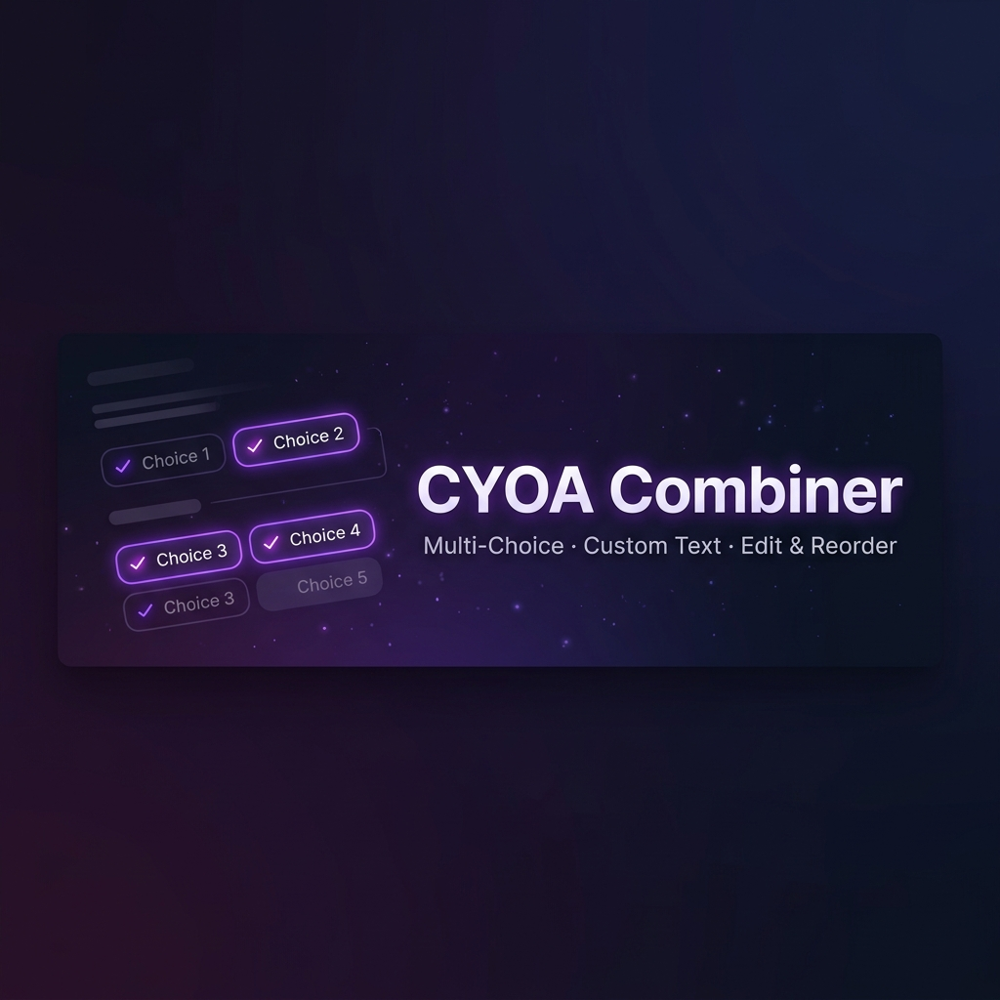

<div align="center">



<br/>

### 🎭 Select multiple CYOA choices, add custom text, edit & reorder — then send it all as one combined message.

<br/>

[](https://github.com/SillyTavern/SillyTavern)
[](https://github.com/TEC-REBEL/cyoa-combiner/releases)
[](LICENSE)
[](https://developer.mozilla.org/en-US/docs/Web/JavaScript)

</div>

---

## 🤔 The Problem

When the AI presents CYOA action choices as clickable buttons, clicking one **immediately sends it** to the LLM. There's no way to:

- Pick **multiple options** at once (*"I want to investigate AND draw my sword"*)
- **Add your own custom actions** alongside AI choices
- **Edit** a choice before sending it
- **Control the order** of your actions

## ✨ The Solution

This extension transforms single-click choices into a **multi-select composition system**.

<br/>

<div align="center">

| Step | What Happens |
|:---:|:---|
| **1** | Click choice buttons → they **highlight** instead of sending |
| **2** | A **composition panel** slides up from the bottom |
| **3** | Add **custom text**, **edit** any item, **reorder** freely |
| **4** | Click **Send Combined** → everything goes as one message |

</div>

<br/>

## 🎯 Features

<table>
<tr>
<td width="50%">

### 🖱️ Multi-Select Choices
Click multiple AI-generated choice buttons. Each gets highlighted with a purple glow and numbered badge showing selection order.

### ✍️ Add Custom Text
Type your own actions, dialogue, or context between choices. Mix freely: *choice → custom text → choice → custom text*.

</td>
<td width="50%">

### ✏️ Inline Editing
Click the pencil icon on any queued item to edit its text in-place. Works for both clicked choices AND custom entries.

### ↕️ Reorder Items
Use up/down arrows to rearrange your queued items. Build exactly the sequence you want before sending.

</td>
</tr>
</table>

### Additional Features

- 🗑️ **Remove individual items** — Click ✕ to remove any item from the queue
- 📐 **Collapsible panel** — Minimize the composition panel when not needed
- ⚡ **Zero config** — Works out of the box, no setup required
- 🔧 **Customizable format** — Change how combined choices are formatted before sending
- 🎨 **Premium dark UI** — Glassmorphic panel with purple/indigo accents that matches SillyTavern's aesthetic

---

## 📦 Installation

### Method 1: SillyTavern Extension Installer
1. Open SillyTavern
2. Go to **Extensions** → **Install Extension**
3. Paste the URL:
   ```
   https://github.com/TEC-REBEL/cyoa-combiner
   ```
4. Click **Install** and reload

### Method 2: Git Clone
```bash
cd SillyTavern/public/scripts/extensions/third-party/
git clone https://github.com/TEC-REBEL/cyoa-combiner.git
```
Then reload SillyTavern.

### Method 3: Manual Download
1. Download this repository as a ZIP
2. Extract to `SillyTavern/public/scripts/extensions/third-party/cyoa-combiner/`
3. Reload SillyTavern

---

## 🎮 Usage

<details>
<summary><strong>Example Flow</strong></summary>

<br/>

Imagine the AI presents these choices:

> 1. 🗡️ *Invite her in warmly and introduce Lilith as your roommate.*
> 2. 🛡️ *Answer the door wearing only a towel to immediately test her reactions.*
> 3. 🏃 *Let her start cleaning and wait for her to find the adult magazine.*
> 4. 📱 *Check your phone to see what Devil Skills Lilith is offering today.*

**With CYOA Combiner:**

1. Click **choice 1** → glows purple, appears in panel
2. Type *"While doing so, whisper to Lilith to play along"* → click **Add**
3. Click **choice 4** → added to panel
4. Optionally **edit** choice 1's text or **reorder** items
5. Click **Send Combined** → all three items sent as one message

The LLM receives:
```
I choose:
1. Invite her in warmly and introduce Lilith as your roommate.
2. While doing so, whisper to Lilith to play along
3. Check your phone to see what Devil Skills Lilith is offering today.
```

</details>

---

## ⚙️ Configuration

Open **Extensions** panel → **CYOA Multi-Choice Combiner**:

| Setting | Description | Default |
|:--------|:------------|:--------|
| **Enable multi-choice** | Master toggle for the extension | ✅ On |
| **Include numbering** | Adds `1.`, `2.` before choices in the sent message | ✅ On |
| **Send Format** | Template for the combined message. Use `{choices}` as placeholder | `I choose:\n{choices}` |

---

## 🔧 Technical Details

<details>
<summary><strong>How it works under the hood</strong></summary>

<br/>

- **Click Interception**: Uses a capture-phase event listener (`addEventListener('click', handler, true)`) to intercept `.custom-menu-msg-button` clicks before any other handler
- **DOMPurify Awareness**: SillyTavern's DOMPurify prefixes all AI-generated CSS classes with `custom-`, so the extension targets `custom-menu-msg-button` (not `menu-msg-button`)
- **Queue System**: Maintains an ordered array of items (choices + custom text) with unique IDs for tracking
- **Send Pipeline**: Uses SillyTavern's native send flow (`#send_textarea` + `#send_but`) for full compatibility
- **Event Integration**: Subscribes to `CHAT_CHANGED`, `MESSAGE_SWIPED`, `GENERATION_STARTED`, and `CHARACTER_MESSAGE_RENDERED` events

</details>

---

## 🤝 Compatibility

- ✅ Any character card that outputs `<button class="menu-msg-button">` elements
- ✅ SillyTavern's built-in features (swipes, branching, bookmarks)
- ✅ All LLM backends (OpenAI, Claude, local models, etc.)
- ✅ Auto-clears on chat switch, swipe, or new generation

---

## 📄 License

[MIT](LICENSE) — Use it, modify it, share it. Have fun! 🎉

---

<div align="center">

**Made with 💜 for the SillyTavern community**

</div>
